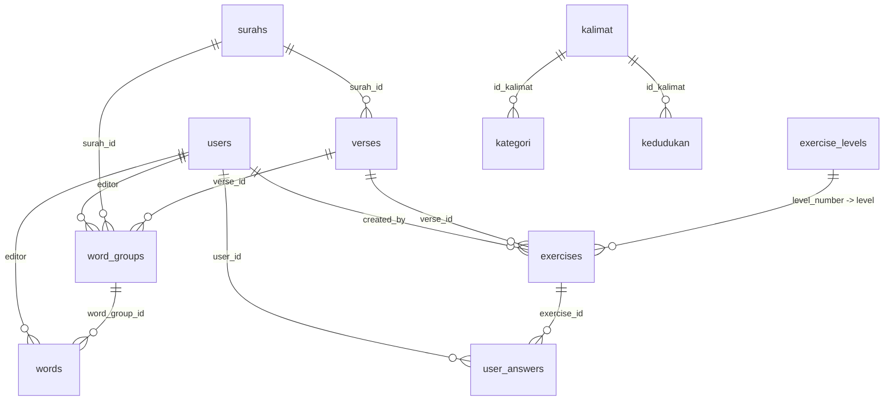

# Dokumentasi Database Model

Dokumen ini merangkum struktur database berdasarkan model Eloquent di `app/Models` dan migration di `database/migrations`.

## Ringkasan Model

| Model | Tabel | Fungsi utama |
| --- | --- | --- |
| `User` | `users` | Akun pengguna, role, verifikasi email, autentikasi Sanctum, dan soft delete. |
| `Product` | `products` | Data produk sederhana untuk katalog/admin. |
| `Surah` | `surahs` | Master data surah Al-Qur'an. |
| `Verse` | `verses` | Ayat per surah beserta teks dan terjemahan Indonesia. |
| `WordGroup` | `word_groups` | Kelompok kata/frasa pada ayat untuk proses grouping analisis. |
| `Word` | `words` | Kata individual beserta informasi nahwu/irob dan editor. |
| `Kalimat` | `kalimat` | Master jenis kalimat dalam data nahwu. |
| `Kategori` | `kategori` | Master kategori nahwu yang berada di bawah `kalimat`. |
| `Kedudukan` | `kedudukan` | Master kedudukan/i'rob yang berada di bawah `kalimat`. |
| `ExerciseLevel` | `exercise_levels` | Master level latihan. |
| `Exercise` | `exercises` | Soal/latihan, termasuk latihan analisis ayat. |
| `UserAnswer` | `user_answers` | Jawaban dan progres user terhadap latihan. |
| `Setting` | `settings` | Penyimpanan konfigurasi key-value aplikasi. |

## ERD Ringkas

## Detail Tabel per Model

### `User` -> `users`

Menyimpan akun pengguna aplikasi.

| Kolom | Tipe | Keterangan |
| --- | --- | --- |
| `id` | bigint unsigned | Primary key. |
| `name` | string | Nama user. |
| `email` | string, unique | Email login. |
| `phone` | string | Nomor telepon. |
| `roles` | string | Role user. Awalnya enum `administrator`, `operator`, `reviewer`, lalu diubah menjadi string default `guest`. |
| `email_verified_at` | timestamp nullable | Waktu verifikasi email. |
| `password` | string | Password, dicast hashed oleh model. |
| `two_factor_secret` | text nullable | Secret 2FA. |
| `two_factor_recovery_codes` | text nullable | Kode recovery 2FA. |
| `two_factor_confirmed_at` | timestamp nullable | Waktu konfirmasi 2FA. |
| `remember_token` | string nullable | Token remember me. |
| `created_at`, `updated_at` | timestamp | Timestamp Laravel. |
| `deleted_at` | timestamp nullable | Soft delete. |

Model:
- `fillable`: `name`, `email`, `password`, `phone`, `roles`.
- `hidden`: `password`, `remember_token`.
- `casts`: `email_verified_at` sebagai `datetime`, `password` sebagai `hashed`.
- Trait: `HasFactory`, `Notifiable`, `SoftDeletes`, `HasApiTokens`.

Relasi:
- `userAnswers()`: has many `UserAnswer`.
- `createdQuestions()`: has many `Question` via `created_by`.

Catatan:
- Model `User::createdQuestions()` masih mengarah ke `Question::class`, sementara migration sudah mengganti `questions` menjadi `exercises`. Relasi ini kemungkinan perlu diganti menjadi `createdExercises()` ke `Exercise::class`.

### `Product` -> `products`

Menyimpan data produk.

| Kolom | Tipe | Keterangan |
| --- | --- | --- |
| `id` | bigint unsigned | Primary key. |
| `name` | string | Nama produk. |
| `description` | string nullable | Deskripsi produk. |
| `price` | integer | Harga, default `0`. |
| `stock` | integer | Stok, default `0`. |
| `category` | enum | Salah satu dari `food`, `drink`, `snack`. |
| `image` | string nullable | Path/nama gambar produk. |
| `created_at`, `updated_at` | timestamp | Timestamp Laravel. |

Model:
- `fillable`: `name`, `description`, `category`, `price`, `stock`, `image`.

Relasi:
- Tidak ada relasi Eloquent yang didefinisikan.

### `Surah` -> `surahs`

Master surah Al-Qur'an.

| Kolom | Tipe | Keterangan |
| --- | --- | --- |
| `id` | unsigned integer | Primary key auto increment. |
| `name` | string(100) | Nama surah. |
| `name_id` | string(100) | Nama Indonesia. |
| `name_en` | string(100) | Nama Inggris/transliterasi. |
| `location` | string(100) | Makkiyah/Madaniyah atau lokasi turun. |
| `verse_count` | integer | Jumlah ayat. |

Model:
- `fillable`: `name`, `name_id`, `name_en`, `location`, `verse_count`.
- `timestamps`: `false`.

Relasi:
- `verses()`: has many `Verse` via `surah_id`.

### `Verse` -> `verses`

Menyimpan ayat.

| Kolom | Tipe | Keterangan |
| --- | --- | --- |
| `id` | unsigned integer | Primary key auto increment. |
| `surah_id` | unsigned integer | Foreign key ke `surahs.id`, cascade delete. |
| `number` | integer | Nomor ayat dalam surah. |
| `text` | text | Teks ayat. |
| `translation_indo` | text nullable | Terjemahan Indonesia. |

Model:
- `fillable`: `surah_id`, `number`, `text`, `translation_indo`.
- `timestamps`: `false`.

Relasi:
- `surah()`: belongs to `Surah`.
- `wordGroups()`: has many `WordGroup` via `verse_id`, diurutkan `order_number` ascending.

### `WordGroup` -> `word_groups`

Kelompok kata/frasa pada ayat.

| Kolom | Tipe | Keterangan |
| --- | --- | --- |
| `id` | unsigned integer | Primary key auto increment. |
| `surah_id` | unsigned integer | Foreign key ke `surahs.id`, cascade delete. |
| `verse_number` | unsigned integer | Dibuat sebagai foreign key ke `verses.id`. |
| `verse_id` | unsigned integer nullable | Foreign key ke `verses.id`, cascade delete. |
| `order_number` | integer nullable | Urutan group dalam ayat. |
| `text` | text | Teks group kata. |
| `editor` | bigint | ID user editor. |
| `created_at`, `updated_at` | timestamp | Timestamp Laravel. |

Model:
- `fillable`: `surah_id`, `verse_number`, `verse_id`, `order_number`, `text`, `created_at`, `updated_at`, `editor`.

Relasi:
- `editorInfo()`: belongs to `User` via `editor`.
- `words()`: has many `Word` via `word_group_id`.

Catatan:
- Nama kolom `verse_number` mengesankan nomor ayat, tetapi migration mendefinisikannya sebagai foreign key ke `verses.id`. Di beberapa controller, kolom ini dipakai seperti nomor ayat. Untuk query yang membutuhkan ayat sebenarnya, `verse_id` lebih aman dipakai.

### `Word` -> `words`

Kata individual dalam `word_groups`, termasuk metadata nahwu/irob.

| Kolom | Tipe | Keterangan |
| --- | --- | --- |
| `id` | unsigned integer | Primary key auto increment. |
| `word_group_id` | unsigned integer | Foreign key ke `word_groups.id`, cascade delete. |
| `order_number` | integer | Urutan kata dalam group. |
| `text` | text | Teks kata. |
| `translation` | text nullable | Terjemahan kata. |
| `kalimat` | string(100) nullable | Jenis kalimat. |
| `color` | string nullable | Warna penanda. |
| `kategori` | text nullable | Kategori nahwu. |
| `hukum` | string(100) nullable | Hukum nahwu. |
| `kedudukan` | string(100) nullable | Kedudukan. |
| `irob` | string(100) nullable | I'rob, hasil rename dari `irab`. |
| `tanda` | string(100) nullable | Tanda i'rob. |
| `simbol` | text nullable | Simbol penanda. |
| `created_at`, `updated_at` | timestamp | Diisi oleh aplikasi/model, tetapi tidak dibuat pada migration awal `words`. |
| `editor` | bigint | Diisi oleh aplikasi/model, tetapi tidak dibuat pada migration awal `words`. |

Model:
- `fillable`: `word_group_id`, `order_number`, `text`, `translation`, `kalimat`, `color`, `kategori`, `hukum`, `kedudukan`, `irob`, `tanda`, `simbol`, `created_at`, `updated_at`, `editor`.

Relasi:
- `editorInfo()`: belongs to `User` via `editor`.
- `wordGroup()`: belongs to `WordGroup` via `word_group_id`.

Catatan:
- `created_at`, `updated_at`, dan `editor` masuk `fillable`, tetapi tidak terlihat ditambahkan pada migration `words` yang tersedia. Jika database aktual memiliki kolom ini dari migration/manual change lain, dokumentasi ini mengikuti model. Jika belum ada, operasi create/update yang mengisi kolom tersebut bisa gagal.
- Di model tertulis `Wordgroup::class`; PHP class name tidak case-sensitive, tetapi penulisan standar yang lebih jelas adalah `WordGroup::class`.

### `Kalimat` -> `kalimat`

Master jenis kalimat untuk data nahwu.

| Kolom | Tipe | Keterangan |
| --- | --- | --- |
| `id` | string | Primary key non-increment. |
| `kalimat_ar` | string | Nama Arab. |
| `kalimat_ar_musyakal` | string | Nama Arab berharakat. |
| `kalimat_in` | string | Nama Indonesia. |
| `created_at`, `updated_at` | timestamp | Ditambahkan migration lanjutan. |

Model:
- `fillable`: `id`, `kalimat_ar`, `kalimat_ar_musyakal`, `kalimat_in`.
- Cache `data-nahwu` dihapus saat data disimpan atau dihapus.

Relasi:
- Tidak ada relasi Eloquent yang didefinisikan, tetapi secara database menjadi parent untuk `kategori.id_kalimat` dan `kedudukan.id_kalimat`.

### `Kategori` -> `kategori`

Master kategori nahwu yang terkait ke `kalimat`.

| Kolom | Tipe | Keterangan |
| --- | --- | --- |
| `id` | string | Primary key non-increment. |
| `id_kalimat` | string | Foreign key ke `kalimat.id`, cascade delete. |
| `order` | integer | Urutan tampilan. |
| `simbol` | string nullable | Simbol kategori. |
| `kategori_ar` | string | Nama Arab. |
| `kategori_ar_musyakal` | string | Nama Arab berharakat. |
| `kategori_in` | string | Nama Indonesia. |
| `hukum` | string nullable | Hukum. |
| `rofa` | string nullable | Tanda/ketentuan rofa. |
| `nashob` | string nullable | Tanda/ketentuan nashob. |
| `jar` | string nullable | Tanda/ketentuan jar. |
| `jazm` | string nullable | Tanda/ketentuan jazm. |
| `created_at`, `updated_at` | timestamp | Ditambahkan migration lanjutan. |

Model:
- Primary key: `id`, string, tidak auto increment.
- `fillable`: `id`, `id_kalimat`, `order`, `simbol`, `kategori_ar`, `kategori_ar_musyakal`, `kategori_in`, `hukum`, `rofa`, `nashob`, `jar`, `jazm`.
- Cache `data-nahwu` dihapus saat data disimpan atau dihapus.

Relasi:
- Tidak ada relasi Eloquent yang didefinisikan, tetapi `id_kalimat` adalah foreign key ke `kalimat.id`.

### `Kedudukan` -> `kedudukan`

Master kedudukan/i'rob yang terkait ke `kalimat`.

| Kolom | Tipe | Keterangan |
| --- | --- | --- |
| `id` | string | Primary key non-increment. |
| `id_kalimat` | string | Foreign key ke `kalimat.id`, cascade delete. |
| `order` | integer | Urutan tampilan. |
| `simbol` | string nullable | Simbol kedudukan. |
| `kedudukan_ar` | string | Nama Arab. |
| `kedudukan_ar_musyakal` | string | Nama Arab berharakat. |
| `kedudukan_in` | string | Nama Indonesia. |
| `irob` | string nullable | Jenis/status i'rob. |
| `created_at`, `updated_at` | timestamp | Ditambahkan migration lanjutan. |

Model:
- Primary key: `id`, string, tidak auto increment.
- `fillable`: `id`, `id_kalimat`, `order`, `simbol`, `kedudukan_ar`, `kedudukan_ar_musyakal`, `kedudukan_in`, `irob`.
- Cache `data-nahwu` dihapus saat data disimpan atau dihapus.

Relasi:
- Tidak ada relasi Eloquent yang didefinisikan, tetapi `id_kalimat` adalah foreign key ke `kalimat.id`.

### `ExerciseLevel` -> `exercise_levels`

Master level latihan. Tabel ini berasal dari `question_levels`, kemudian di-rename menjadi `exercise_levels`.

| Kolom | Tipe | Keterangan |
| --- | --- | --- |
| `id` | bigint unsigned | Primary key. |
| `name` | string(100) | Nama level. |
| `slug` | string(100) nullable unique | Slug untuk URL/query level. |
| `level_number` | integer unique | Nomor level, dipakai sebagai penghubung ke `exercises.level`. |
| `display_order` | integer nullable | Urutan tampilan. |
| `description` | text nullable | Deskripsi level. |
| `is_active` | boolean | Status aktif, default `true`. |
| `metadata` | json nullable | Data tambahan. |
| `created_at`, `updated_at` | timestamp | Timestamp Laravel. |

Model:
- `fillable`: `name`, `slug`, `level_number`, `display_order`, `description`, `is_active`, `metadata`.
- `casts`: `metadata` sebagai `json`, `is_active` sebagai `boolean`.
- Scope: `active()`.

Relasi:
- `exercises()`: has many `Exercise` dengan mapping `exercise_levels.level_number` ke `exercises.level`.

### `Exercise` -> `exercises`

Menyimpan soal atau latihan. Tabel ini berasal dari `questions`, kemudian di-rename menjadi `exercises`.

| Kolom | Tipe | Keterangan |
| --- | --- | --- |
| `id` | bigint unsigned | Primary key. |
| `title` | string(255) | Judul latihan. |
| `description` | text nullable | Deskripsi/konteks latihan. |
| `content` | text nullable | Isi latihan, dicast JSON oleh model. |
| `level` | tiny integer | Nomor level, default `1`. |
| `type` | enum | `multiple_choice`, `short_answer`, `essay`, atau `analysis`. |
| `verse_id` | unsigned integer nullable | Foreign key ke `verses.id`, cascade delete. |
| `options` | json nullable | Opsi jawaban untuk pilihan ganda. |
| `correct_answer` | text nullable | Jawaban benar. |
| `explanation` | text nullable | Penjelasan jawaban. |
| `display_order` | integer nullable | Urutan tampilan. |
| `is_active` | boolean | Status aktif, default `true`. |
| `attempts` | integer | Jumlah percobaan, default `0`. |
| `passed` | integer | Jumlah user yang lulus, default `0`. |
| `metadata` | json nullable | Data tambahan. |
| `created_by` | bigint unsigned | Foreign key ke `users.id`, cascade delete. |
| `created_at`, `updated_at` | timestamp | Timestamp Laravel. |

Index:
- `level`, `type`.
- `is_active`.
- `created_by`.

Model:
- `fillable`: `title`, `description`, `content`, `level`, `type`, `verse_id`, `options`, `correct_answer`, `explanation`, `display_order`, `is_active`, `attempts`, `passed`, `metadata`, `created_by`.
- `casts`: `content`, `options`, `metadata` sebagai `json`; `is_active` sebagai `boolean`.
- `appends`: `display_content`, `display_correct_answer`.
- Scope: `active()`, `byLevel($level)`, `byType($type)`.

Relasi:
- `verse()`: belongs to `Verse`.
- `creator()`: belongs to `User` via `created_by`.
- `userAnswers()`: has many `UserAnswer`.
- `exerciseLevel()`: belongs to `ExerciseLevel` dengan mapping `exercises.level` ke `exercise_levels.level_number`.

Accessor:
- `display_content`: untuk `type = analysis`, mengambil `verse.text`; selain itu mengambil `description`.
- `display_correct_answer`: untuk `type = analysis`, mengambil `verse.translation_indo`; selain itu mengambil `correct_answer`.

### `UserAnswer` -> `user_answers`

Menyimpan progres/jawaban user terhadap latihan.

| Kolom | Tipe | Keterangan |
| --- | --- | --- |
| `id` | bigint unsigned | Primary key. |
| `user_id` | bigint unsigned | Foreign key ke `users.id`, cascade delete. |
| `exercise_id` | bigint unsigned | Foreign key ke `exercises.id`, cascade delete. Kolom ini berasal dari rename `question_id`. |
| `level` | tiny integer | Level latihan, default `1`. |
| `passed` | boolean | Status lulus, default `false`. |
| `score` | decimal(5,2) nullable | Skor jawaban. |
| `attempt_count` | integer | Jumlah percobaan, default `1`. |
| `time_spent` | integer nullable | Waktu pengerjaan dalam detik. |
| `is_latest` | boolean | Menandai jawaban terbaru, default `true`. |
| `metadata` | json nullable | Data tambahan. |
| `created_at`, `updated_at` | timestamp | Timestamp Laravel. |

Index:
- `user_id`, `level`.
- `user_id`, `exercise_id`.
- `passed`.

Model:
- `fillable`: `user_id`, `exercise_id`, `level`, `passed`, `score`, `attempt_count`, `time_spent`, `is_latest`, `metadata`.
- `casts`: `passed` dan `is_latest` sebagai `boolean`, `metadata` sebagai `json`, `score` sebagai `decimal:2`.
- `hidden`: `answer`.
- `appends`: `completed`.
- Scope: `latest()`, `passedByLevel($userId, $level)`.

Relasi:
- `user()`: belongs to `User`.
- `exercise()`: belongs to `Exercise`.

Catatan:
- Accessor `getCompletedAttribute()` mengembalikan `$this->pass`, sedangkan kolom yang ada adalah `passed`. Ini kemungkinan typo dan akan membuat `completed` tidak sesuai harapan.
- `hidden` berisi `answer`, tetapi kolom `answer` tidak terlihat pada migration `user_answers`.

### `Setting` -> `settings`

Menyimpan konfigurasi aplikasi dalam bentuk key-value.

| Kolom | Tipe | Keterangan |
| --- | --- | --- |
| `id` | bigint unsigned | Primary key. |
| `key` | string unique | Nama konfigurasi. |
| `value` | text nullable | Nilai konfigurasi. Bisa berupa string atau JSON. |
| `created_at`, `updated_at` | timestamp | Timestamp Laravel. |

Model:
- `fillable`: `key`, `value`.

Helper:
- `getValue($key, $default = null)`: mengambil value dan decode JSON bila valid.
- `setValue($key, $value)`: menyimpan value; array/object akan di-encode JSON.
- `getIntArray($key)`: membaca setting sebagai array integer.
- `getJson($key, $default = [])`: membaca setting sebagai array JSON.

## Tabel Pendukung Tanpa Model Khusus

Tabel berikut ada di migration, tetapi tidak memiliki model aplikasi custom di `app/Models`:

| Tabel | Fungsi |
| --- | --- |
| `password_reset_tokens` | Token reset password Laravel/Fortify. |
| `sessions` | Penyimpanan session database. |
| `cache`, `cache_locks` | Penyimpanan cache database. |
| `jobs`, `job_batches`, `failed_jobs` | Queue dan riwayat job gagal. |
| `personal_access_tokens` | Token API Laravel Sanctum. |

## Catatan Integritas dan Perawatan

- Beberapa relasi database belum dituangkan sebagai method Eloquent, khususnya `Kalimat` ke `Kategori/Kedudukan` dan sebaliknya. Menambah relasi tersebut akan membuat query lebih ekspresif.
- Ada beberapa nama lama dari fitur `Question` yang masih tersisa pada kode/model, sedangkan tabel sudah menjadi `Exercise`.
- Gunakan `exercise_levels.level_number` sebagai referensi logis untuk `exercises.level`; ini bukan foreign key eksplisit di migration.
- Untuk `word_groups`, disarankan menjadikan `verse_id` sebagai sumber utama relasi ke ayat karena penamaan dan pemakaian `verse_number` belum konsisten.
- Dokumentasi ini mengikuti migration yang tersedia di repo. Jika database produksi punya perubahan manual di luar migration, jalankan perbandingan schema sebelum menjadikannya sumber kebenaran final.
